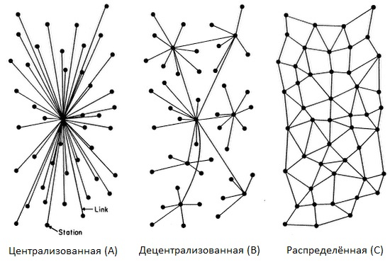

### Закрытый ключ и открытый ключ
Открытый ключ используется для шифрования и проверки цифровой подписи. Закрытый ключ — для декодирования и создания цифровой подписи.

### Подпись (ЭЦП)
Это массив байт, по которому с помощью открытого ключа можно убедиться о неизменности подписанных пользовательских данных.

### Сертификат ключа
Это частный случай подписанных данных, который подтверждает принадлежность открытого ключа конкретному владельцу. В данном случае пользовательские данные содержат:
Открытый ключ пользователя.
Информацию о владельце ключа.
Описание правовой области применения открытого ключа (что им можно подписать).
Эти данные подписываются удостоверительным центром, который также имеет сертификат вышестоящего центра. И так до нескольких корневых центров, открытые ключи которым всем известны, как и то кому они принадлежат.

>>> Если не требуется сопоставлять владельца подписи и открытый ключ, а просто убедиться в отсутствии изменений, то достаточно только: проверяемых данных, подписи и открытый ключ. Сертификат в этом случае не нужен.

### Типы сетей

### Носитель
Это один из физических узлов сети - персональный компьютер, мобильное устройство и т. п.