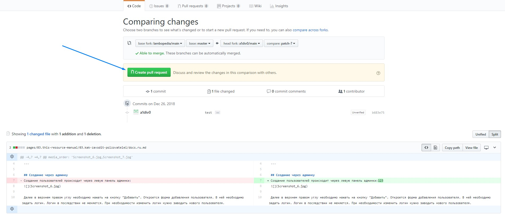
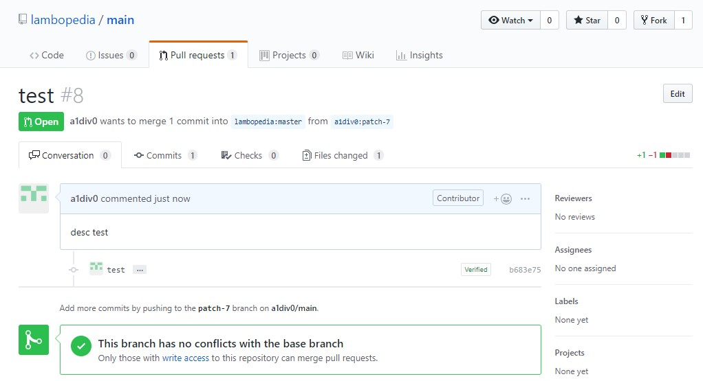
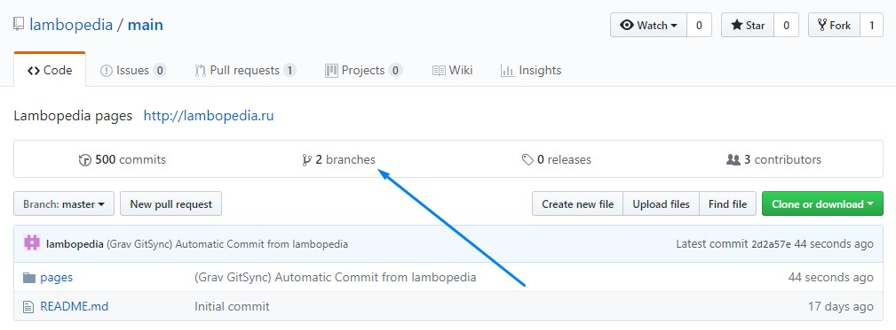
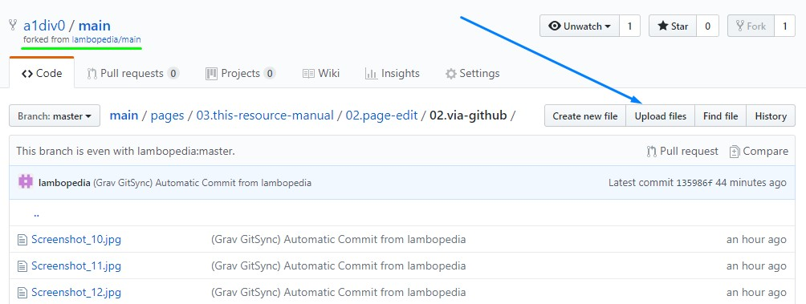
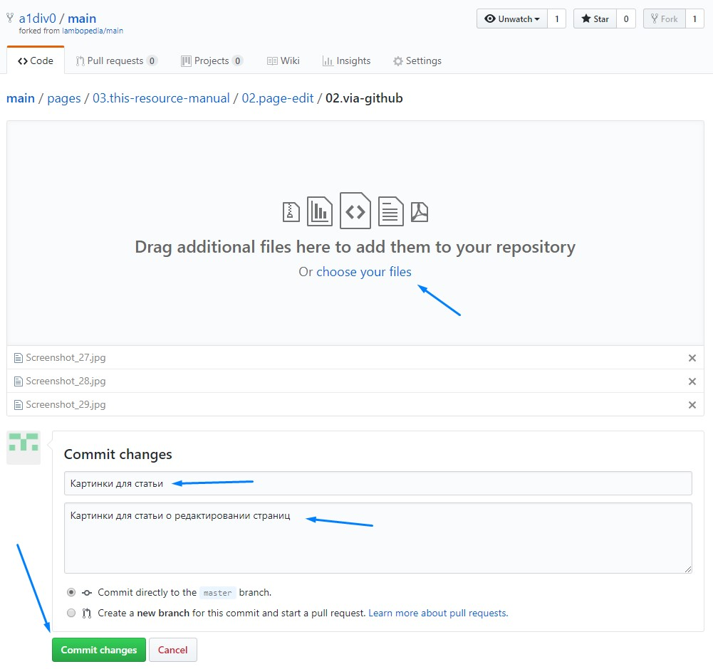
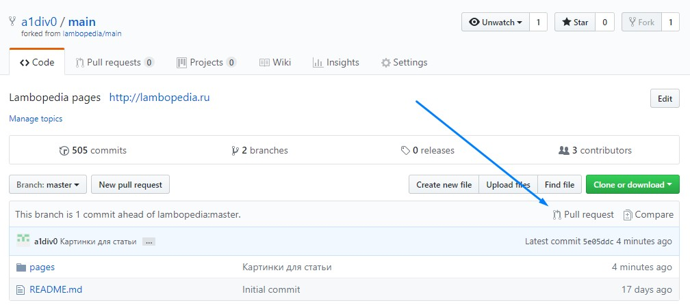
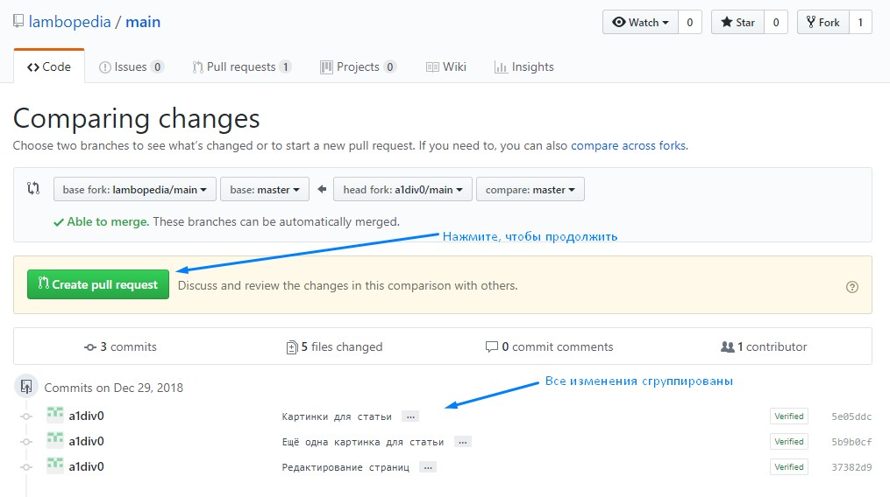
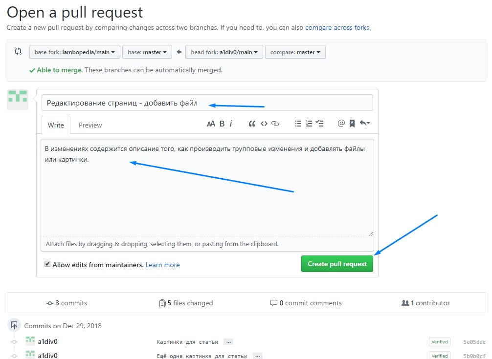
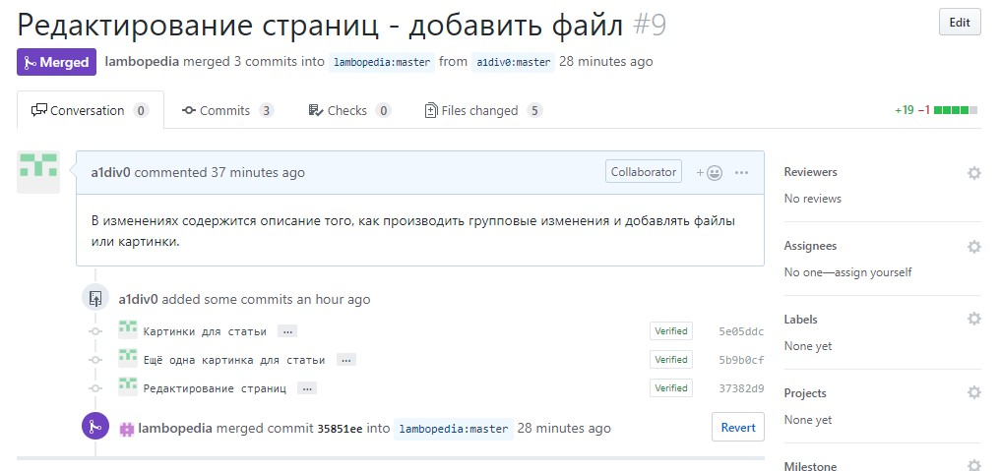
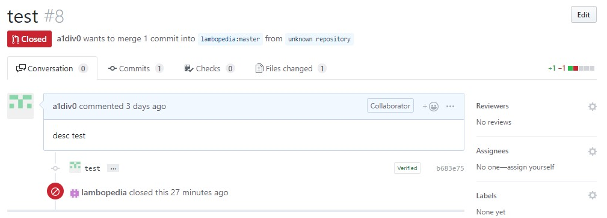

Данный вариант доступен всем желающим, но содержит премодерацию. Премодерация необходима в первую очередь для защиты от вандализма. Чтобы начать редактирование, необходимо иметь регистрацию на [GitHub](https://github.com/).

## Самый простой случай
В качестве самого простого случая необходимо отредактировать текст страницы.  
Чтобы редактировать выбранную страницу, сделайте следующее:
1. Нажмите в верхнем правом углу ссылку "Редактировать эту страницу" (вы перейдёте на GitHub).
2. Нажмите кнопку с карандашиком "Edit the file in your fork of this project" ("Редактировать файл в вашем ответвлении проекта"):


3. Внесите необходимые изменения. 
>>>>>> Ознакомьтесь с [возможностями оформления страницы](../markdown).

5. Ниже под редактором внесите информацию о предлагаемых Вами изменениях. Описание попадает в историю и становится достоянием общественности, учтите это. После добавления информации необходимо нажать "Propose file change" ("Предложить изменения файла"). Вообще можно много раз делать изменения, все они сохраняются в текущей учётной записи - об этом подробней будет сказано ниже.


5. Далее необходимо нажать "Pull request". Редактируем описание, если необходимо. Нажимаем "Pull request". 


6. Если всё хорошо, вы увидите зелёненькую галочку как на картинке ниже. Изменения появятся после одобрения модератором.


## Кто-то внёс изменения раньше Вас
Если параллельно с Вами кто-то внёс изменения в страницу раньше Вас, то после нажатия на кнопку "Pull request" появится блок предупреждающий об этом. В этом случае необходимо нажать кнопку "Resolve conflicts" и отредактировать изменения. После чего необходимо нажать кнопку "Mark as resolved".

## Добавить новую страницу
Для создания новой страницы справочного портала:
1. Откройте раздел в котором будет расположена новая страница.
2. Нажмите ссылку "редактировать эту страницу".
3. Перейдите в директорию раздела.  


4. Нажмите кнопку "Create new file" ("Создать новый файл").


5. В адресной строке вводим латинскими буквами название статьи (можно использовать символы тире). Затем введите символ "/" и "docs.ru.md" - для статьи и "chapter.ru.md" - для раздела. 


Вот примерно как это происходит:


6. В текстовое поле скопируйте шаблон текста и внесите содержиое страницы:
``` markup
---
title: 'Здесь заголовок страницы'
visible: true
---
Здесь текст страницы
```  

7. Под редактором внесите описание новой страницы для модератора и надмите кнопку "Propose new file" ("Предложить новый файл").


8. Нажимаем "Pull request".

## Если Вы закрыли страницу после Propose, но до Pull request
1. Переходим в корень репозитория, нажимая сюда:


2. Открываем список своих веток, нажимая на "branches":



4. Далее нажимаем кнопку "Pull request" напротив готовых изменений. Редактируем описание, если необходимо. Нажимаем "Pull request". Изменения появятся после одобрения модератором.

## Много изменений + добавить файл или картинку
Случай с добавлением файла немного более сложный, как правило, кроме добавления файла, ещё редактируется страница, в которой делается ссылка на этот файл. Вообще GitHub позволяет группировать все изменения, путём создания Вашей собственной версии страниц справочного портала. Это называется Fork (ответвление). Чтобы его создать:
1. Нажмите на портале "редактировать эту страницу", затем нажмите кнопку "Fork".


2. Теперь можно загружать файлы. Сделать это можно перейдя в раздел со страницей и нажав кнопку "Upload files" ("Загрузить файлы"). Чтобы потом было удобно ссылаться на файл или картинку в тексте, называйте файл только латинскими буквами, тире и цифрами. Есть ограничение на расширения, т. е. файлы не всех расширений можно добавлять. При необходимости уточняйте у модератора. Размер файла не должен превышать 25МБ.



3. После добавления файлов, добавляем их описание и нажимаем "Commit changes".



4. Далее находим страницу и редактируем её (как - описано выше).
5. После того, как все изменения внесены, необходимо нажать кнопку "Pull request".



6. GitHub сгруппирует все изменения и покажет отличия от основной версии. Чтобы продолжить, нажмите зелёную кнопку "Create pull request". 



7. Отредактируйте описание изменений для модератора и нажмите "Create pull request". Изменения появятся на портале, после того как модератор примет изменения.



8. Принятые или отклонённые изменения появятся в уведомлениях. Можно перейти в изменения и прочитать комментарии.


Принятые изменения:



Отклонённые изменения:


